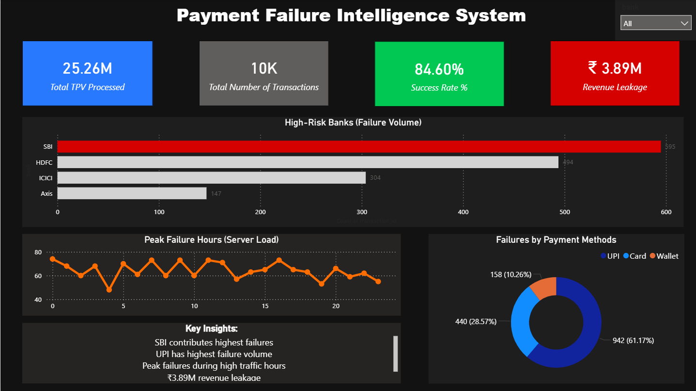

# Payment Failure Intelligence System 🚀

## 📌 Project Overview
Designed and developed an end-to-end transaction monitoring dashboard to analyze a 15% payment failure rate across 10,000+ records. This project identifies critical server-load bottlenecks during peak trading hours and isolates high-risk partner banks to mitigate revenue leakage. 

Built with the scale of high-volume fintech operations in mind (e.g., Paytm, Cred, PhonePe), this system provides actionable intelligence for engineering and P2P finance teams to optimize routing and retry mechanisms.

## 🛠️ Tech Stack
- **Database/Extraction:** MySQL
- **Data Visualization & Logic:** Power BI, DAX
- **Domain:** Fintech Operations, Payment Gateways, Procure-to-Pay (P2P)

## 🚨 Key Business Insights
1. **SBI** contributes the highest failure volume among partner banks.
2. **UPI** has the highest failure rate compared to cards and net banking.
3. **Peak System Crashes** occur strictly during high-traffic hours: **11:00 AM & 4:00 PM**.
4. **₹3.89M (₹38.8 Lakhs)** in total revenue leakage detected and flagged for immediate attention.

## 📂 Repository Structure
- `data/` : Contains the raw transaction dataset (CSV). *(Note: Do not upload actual sensitive data to public repos)*
- `sql/` : Contains the SQL scripts used for backend data extraction and validation.
- `powerbi/` : Contains the `.pbix` dashboard file and a text file of all DAX measures.

## 📸 Dashboard Preview

---
*Built by Gopal Rawat | Data & Business Analyst*
